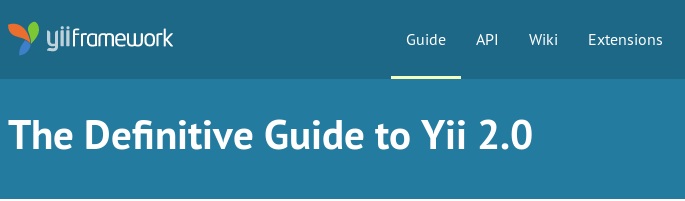
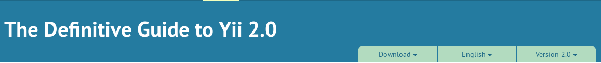
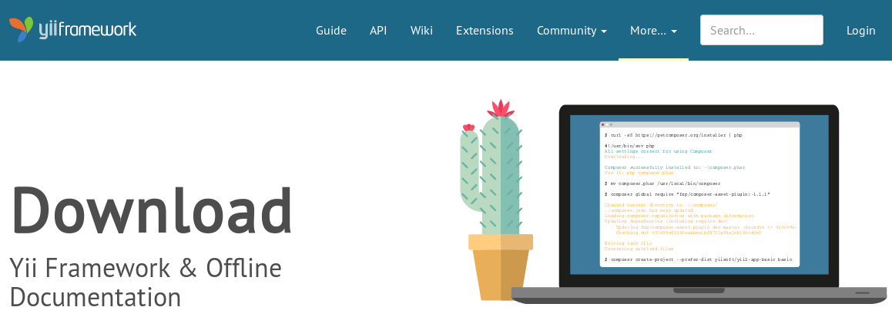

Navigation and Headlines
========================

The content of the website is organized in a tree structure.
All content is reachable by clicking a link in the main navigation
and navigating through sub-pages from there.

The currently opened page is indicated to the user by highlighting the
section of the main navigation the page belongs to and also
by showing the long title of the page in the main headline section.

There are two types of sections in the website:

- Informational **static pages** (mainly those found under "More" in the main navigation)
- Hierarchical **sections** with subcontent (all other items in the main navigation + the news section)

Main Navigation
---------------

The main navigation contains the following 5 items (Navigation name - section name):

- Guide - "The definitive Guide to Yii"
- API - "API Documentation for Yii"
- Wiki - "Wiki Articles"
- Extensions - "Extensions"
- Community - "Yii Community"

Additional content is listed under a 6th point called "More".

Headlines
---------

### Section pages

When a page belongs to one of the main points listed in the main navigation,
a headline is displayed which shows the name of the section a page belongs to.




#### Content variant selectors

If a section contains content for different Yii versions or in different languages,
the section headline also contains selectors for either or both of these:



As shown in the example, also different representations of the same content, e.g.
HTML download or PDF format can be presented in the same way as language and version selectors.

When opening a section through the main navigation, the selectors will
be set to the following default values:

- the language will be the language detected by the browsers
  preferences sent through the `Accepted-Languages` header.
  
- the default version is the latest stable release of Yii.

### Static pages

An informational static page does not display a section name and directly displays the
page content, which is usually the page title on the left, illustrated by an icon on the right.




Page titles
-----------

HTML `<title>` content is generated base on the nesting of pages.
The front page will have its own title: `Yii: the fast, secure, and efficient PHP framework`.
All other pages will end the title in `Yii PHP Framework`.
The title will be prefixed by the name of the page section if any and the page headline. e.g.

```
The definitive Guide to Yii | Yii PHP Framework
Some cool article | Wiki | Yii PHP Framework
...
```